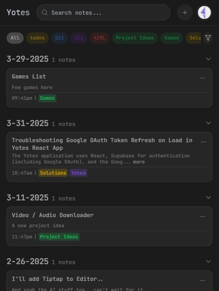

# Yotes

Yotes is a privacy-first notes application with real-time sync powered by Convex and authentication via Supabase. Built with a sleek, dark-themed interface using React and Tailwind CSS, Yotes keeps your notes, tags, and AI settings in your own Convex database with per-user access control. Check out the live site at [yotes.vercel.app](https://yotes.vercel.app).

## Vision

Yotes prioritizes user privacy and control by keeping data in a secure, real-time Convex database per user. Beyond note-taking, it aims to provide fast search, organized tagging, and AI-powered insights while remaining lightweight and user-controlled.

## Features

- **Privacy-Focused Notes**: Create, edit, and delete notes stored securely in Convex with per-user access control.
- **Real-time Sync**: Notes and tags update instantly across sessions via Convex live queries.
- **Tagging System**: Categorize notes with customizable tags.
- **Search & Filter**: Quickly find notes by content or tags.
- **Activity Heatmap**: Visualize note creation over the past year in the Settings page.
- **Responsive Design**: Works seamlessly on desktop and mobile.
- **Google OAuth**: Secure sign-in via Supabase authentication.
- **Dark Theme**: Default dark mode with JetBrains Mono font for a developer-friendly experience.
- **Toast Notifications**: Real-time feedback for actions like saving or errors.
- **Offline Access**: Work with notes offline; changes sync upon reconnection.
- **Installable PWA**: Add Yotes to your home screen for a native app-like experience.
- **AI-Powered Search Summaries**: Get intelligent summaries of search results, highlighting themes and takeaways (powered by Google Gemini).

## Screenshots


_Yotes interface on a desktop device_


_Yotes interface on a mobile device_

## Planned Features (TODO)

From Yashraj’s rough TODO list, here’s what’s in the pipeline:
- [ ] Export/import functionality.
- [ ] PDF viewer and download capabilities.
- [ ] Rich previews for links (e.g., website showcases, YouTube embeds).
- [ ] AI-powered note assistance (e.g., description generation, in-note Q&A)
- [ ] Markdown support for notes.
- [ ] Dedicated support for dropping files (images, videos, links) with specialized views.

## Tech Stack

- **Frontend**: React, React Router, Vite
- **Styling**: Tailwind CSS, shadcn/ui, Lucide icons
- **Backend**: Convex (database, server functions, actions)
- **Auth**: Supabase Auth (Google OAuth)
- **Offline & PWA**: IndexedDB (local cache for session/migration), Workbox (PWA/service worker)
- **AI**: Google Gemini API (proxied via Convex actions)
- **State Management**: React Contexts (NotesContext, ToastContext, ThemeContext)
- **Build Tools**: Vite, ESLint, PostCSS
- **Dependencies**: See `package.json`

## Prerequisites

- Node.js (v18+ recommended)
- Google account for OAuth
- Supabase project with Google OAuth configured
- `.env` file with Supabase credentials

## Installation

1. **Clone the Repository**
   ```bash
   git clone https://github.com/rajofearth/yotes.git
   cd yotes
   ```

2. **Install Dependencies**
   ```bash
   npm install
   ```

3. **Set Up Environment Variables**
   Create a `.env` file in the root:
   ```
   VITE_SUPABASE_URL=your-supabase-url
   VITE_SUPABASE_ANON_KEY=your-supabase-anon-key
   ```
   - Get these from your Supabase project dashboard.

4. **Run Locally**
   ```bash
   npm run dev
   ```
   Visit `http://localhost:3000` in your browser.

## Usage

1. **Sign In**: Log in with Google.
2. **Create Notes**: Use the "+" button in the navbar to add notes.
3. **Organize**: Add tags or (soon) import files like PDFs.
4. **Search & Filter**: Use the search bar or tag filters on the homepage.
5. **Track Activity**: Check your note heatmap in Settings.
6. **Manage Account**: Log out or delete your account from Settings.

## Development

- **Lint**: `npm run lint` for ESLint checks.
- **Build**: `npm run build` for production assets in `dist/`.
- **Preview**: `npm run preview` to test the build locally.

## Deployment

Configured for Vercel with SPA routing via `vercel.json`. Add `.env` variables to Vercel’s settings. The live site is available at [yotes.vercel.app](https://yotes.vercel.app).

## Contributing

Contributions are welcome! To contribute:
1. Fork the repo: `https://github.com/rajofearth/yotes`.
2. Create a branch: `git checkout -b feature/your-feature`.
3. Commit changes: `git commit -m "Add your feature"`.
4. Push: `git push origin feature/your-feature`.
5. Submit a pull request.

## License

Currently unlicensed; a license will be added as the project evolves.

## Acknowledgments

- Created by Yashraj Maher (GitHub: [rajofearth](https://github.com/rajofearth)).
- Thanks to the React, Tailwind, Supabase, Convex, and OSS communities.

